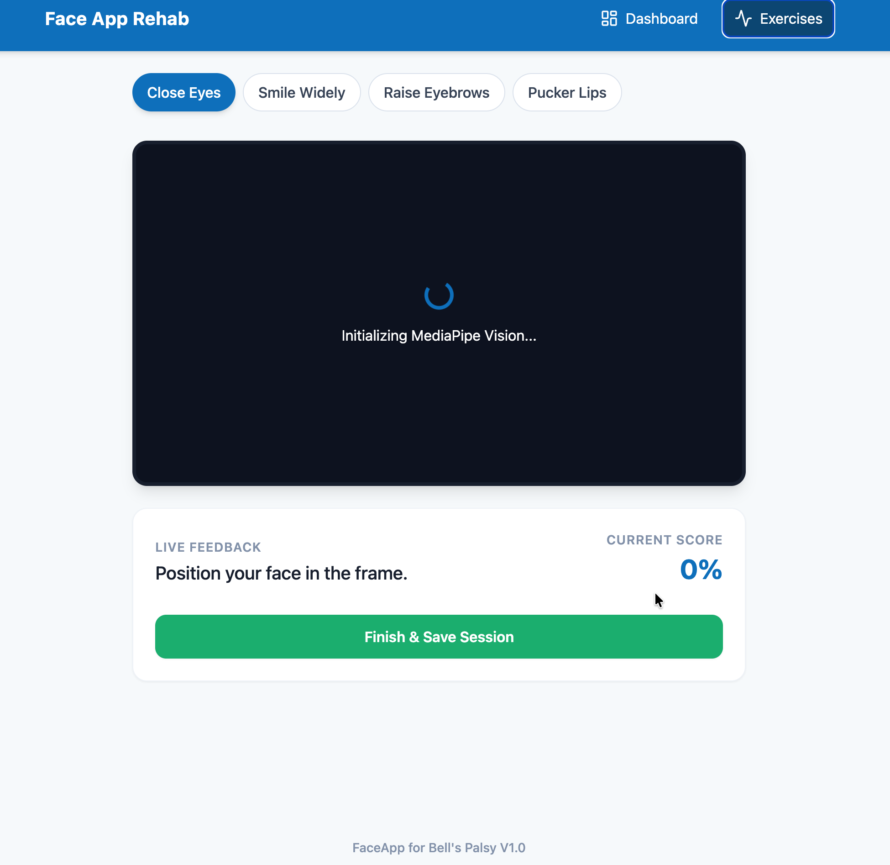
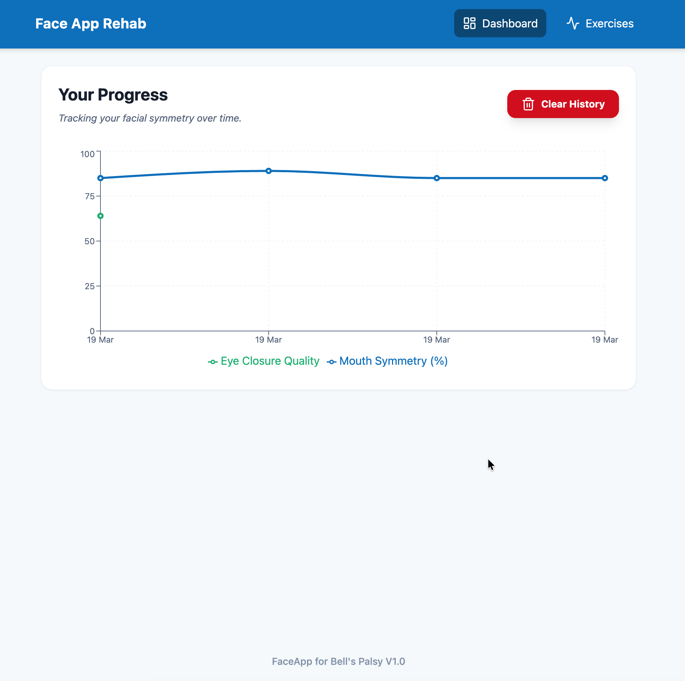

# FaceApp Rehab V1.0 

> **Facial Symmetry Tracking for Bell's Palsy Recovery**

FaceApp Rehab is a professional-grade Progressive Web App (PWA) designed to assist patients recovering from Bell's Palsy and other facial nerve conditions. Using **MediaPipe Face Mesh**, it provides real-time feedback on facial symmetry and motor function.

---

##  Interface Preview

  
  
  
<em>Left: Real-time Computer Vision Exercise Guide | Right: Recovery Analytics Dashboard </em>

##  Key Features

* **Real-time Biometrics:** Precise tracking of **EAR (Eye Aspect Ratio)** and eyebrow/mouth symmetry using 468+ facial landmarks.
* **Edge Computing:** All AI processing happens locally on your device—ensuring 100% patient privacy.
* **Progress Tracking:** Interactive charts visualize recovery trends over days and weeks.
* **PWA Ready:** Install the app directly to your iOS or Android home screen for offline therapy sessions.
* **Data Control:** Secure local storage with a "One-Click Clear" feature to manage your clinical history.

---

## Technical Stack

- **Frontend:** React.js, Vite, Tailwind CSS
- **AI/ML:** Google MediaPipe (Face Mesh Solution)
- **Charts:** Recharts (D3-based)
- **Icons:** Lucide React
- **Storage:** Web Storage API (Local-first architecture)

---
## Quick Start
1. Ensure Node.js is installed (v16+ recommended).
2. Clone the repository.
3. Install dependencies: `npm install`
4. Start the development server: `npm run dev`
5. Open `http://localhost:5173` in your browser.

## Architecture Guidelines
- **`/utils/metrics.js`**: Contains purely mathematical, stateless functions for calculating distances and ratios.
- **`/hooks/useFaceMesh.js`**: Isolates the side-effects of webcam access and the MediaPipe WebAssembly lifecycle.
- **State Management**: Context API / LocalStorage for session persistence to ensure data never leaves the patient's device.

- Active under development
